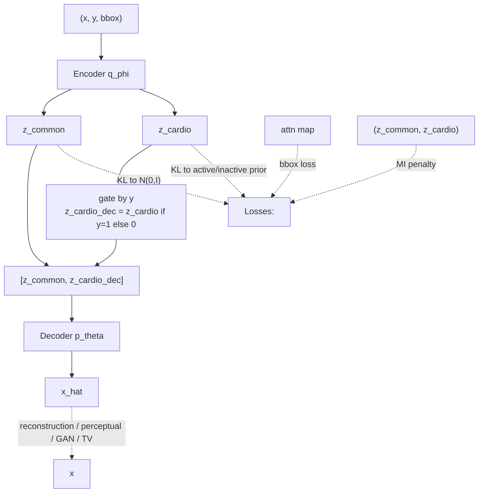
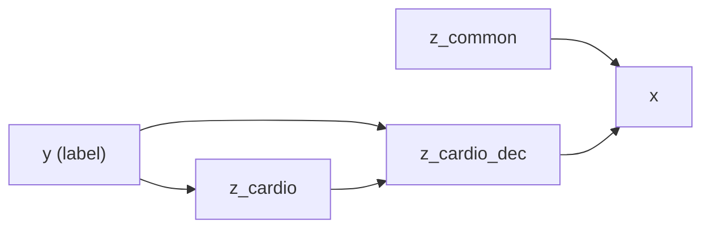
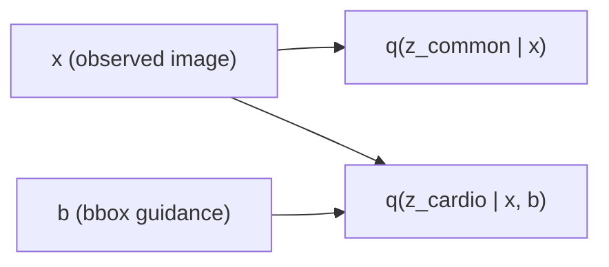
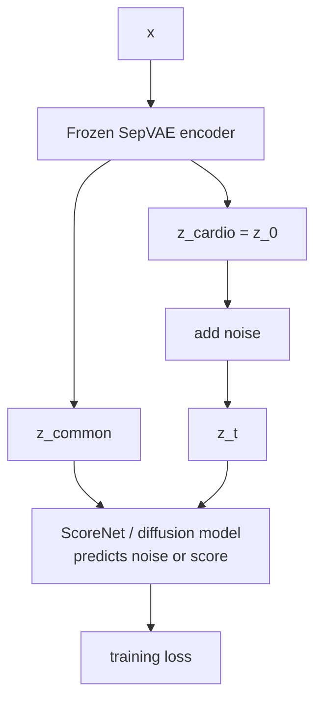
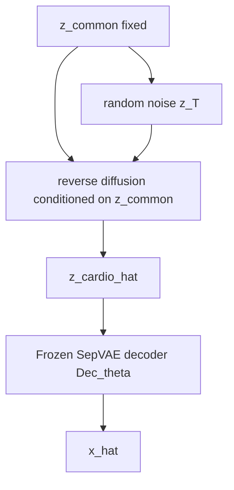
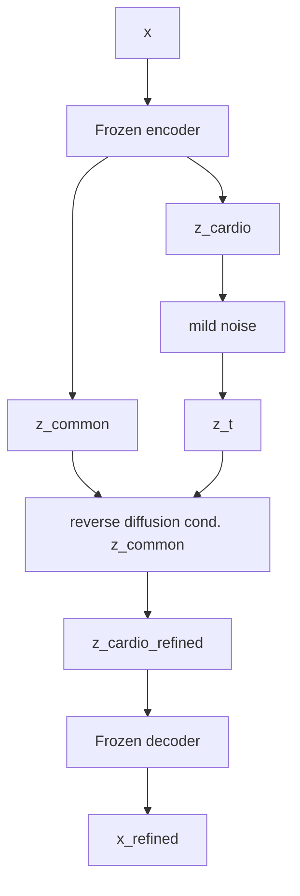

# SepVAE to Conditional LDM: Probabilistic Decomposition

This is the clean way to think about it.

The current V2 setup is a binary latent codec with `z_common` and `z_cardio` at `16x16`, and the D4/D5 checkpoint is the boundary between "learn a useful latent space" and "learn a prior over that latent space"; that matches [run/train_sep_vae.py](run/train_sep_vae.py) and [ARCHITECTURE.md](ARCHITECTURE.md).

## Stage 1: Train SepVAE to D4 or D5

Intent:  
Learn a frozen encoder-decoder pair such that:
- `z_common` carries shared anatomy/acquisition structure
- `z_cardio` carries cardiomegaly-specific residual structure
- the decoder can reconstruct from `[z_common, z_cardio]`

Simple probabilistic story:

Data:

$$
\begin{aligned}
x &= \text{chest x-ray} \\
y &\in \{0,1\} \quad \text{where } 0=\text{normal},\ 1=\text{cardiomegaly} \\
b &= \text{bbox used only as supervision/attention guidance}
\end{aligned}
$$

Inference model:

$$
q_{\phi}(z_{\text{common}}, z_{\text{cardio}} \mid x, b)
\;\approx\;
q_{\phi}(z_{\text{common}} \mid x)\, q_{\phi}(z_{\text{cardio}} \mid x, b)
$$

This line is making an approximate posterior-factorisation assumption:

$$
\begin{aligned}
q_{\phi}(z_{\text{common}} \mid x) &= \mathcal{N}(\mu_c(x), \operatorname{diag}(\sigma_c^2(x))) \\
q_{\phi}(z_{\text{cardio}} \mid x,b) &= \mathcal{N}(\mu_d(x,b), \operatorname{diag}(\sigma_d^2(x,b)))
\end{aligned}
$$

Interpretation:
- the encoder is parameterised as two separate latent heads rather than one joint Gaussian with a full cross-covariance term
- `z_common` is inferred from the image alone
- `z_cardio` is inferred from the image, with optional bbox guidance to help localise disease-relevant structure

Important assumption behind the screenshot:
- this is an encoder-side approximation, not an exact statement that the two latents are truly independent
- the two heads still share an upstream encoder, so they can remain statistically entangled in practice
- that is why the model also uses `L_MI`: the factorisation in the variational family does not by itself guarantee disentanglement

Priors:

$$
\begin{aligned}
p(z_{\text{common}}) &= \mathcal{N}(0, I) \\
p(z_{\text{cardio}} \mid y=1) &= \mathcal{N}(0, I) \\
p(z_{\text{cardio}} \mid y=0) &= \mathcal{N}(0, \sigma_{\text{inactive}}^2 I)
\end{aligned}
$$

Interpretation:
- `p(z_{\text{cardio}} \mid y=0)` is the prior over the cardio latent for samples whose label is normal; it does not mean "select only cardio images."
- When `y=0`, the model is encouraged to keep `z_cardio` close to zero, so the disease head stays inactive on normal examples.
- When `y=1`, `z_cardio` is allowed to carry cardiomegaly-specific variation.

What `\sigma_{\text{inactive}}^2` is doing:

If

$$
q(z_{\text{cardio}} \mid x,b) = \mathcal{N}(\mu_q, \operatorname{diag}(\sigma_q^2)),
$$

then for inactive samples the KL is measured against

$$
\mathcal{N}(0, \sigma_{\text{inactive}}^2 I).
$$

So the inactive KL contains terms of the form

$$
\frac{\mu_q^2}{\sigma_{\text{inactive}}^2}
\quad \text{and} \quad
\frac{\sigma_q^2}{\sigma_{\text{inactive}}^2}.
$$

When `\sigma_{\text{inactive}}` is small, these terms become expensive. For example, if `\sigma_{\text{inactive}} = 0.1`, then `1 / \sigma_{\text{inactive}}^2 = 100`. So the encoder is strongly pushed to make the inactive disease posterior narrow and centered near zero.

That is different from hard-zeroing:
- the KL term says "for normal samples, keep the posterior for `z_cardio` very close to zero"
- the decoder gate says "for normal samples, even if the encoder produced some small residual, do not let the decoder use it"

Together they make the inactive disease head both cheap to ignore and structurally unable to affect reconstruction.

Decoder:

$$
\begin{aligned}
z_{\text{cardio,dec}} &=
\begin{cases}
z_{\text{cardio}}, & y=1 \\
0, & y=0
\end{cases} \\
p_{\theta}(x \mid z_{\text{common}}, z_{\text{cardio,dec}})
\end{aligned}
$$

This is equivalent to `y * z_cardio` only because `y \in \{0,1\}`. The important point is that the gating is applied only to the disease-specific branch. `z_common` is always passed to the decoder unchanged.

Reconstruction:

$$
\hat{x} = \mathrm{Dec}_{\theta}(z_{\text{common}}, z_{\text{cardio,dec}})
$$

So all x-rays are used during training, but they are decoded differently:
- normal image (`y=0`): reconstruct from `z_common` alone
- cardiomegaly image (`y=1`): reconstruct from `z_common` and `z_cardio`

The key structural assumption is:

$$
\begin{aligned}
\text{shared anatomy} &\longrightarrow z_{\text{common}} \\
\text{disease residual} &\longrightarrow z_{\text{cardio}} \\
\text{normal images} &\longrightarrow z_{\text{cardio,dec}} = 0
\end{aligned}
$$

Training objective, in plain form:

$$
\begin{aligned}
\mathcal{L}_{\text{sepvae}} =\;&
\mathrm{reconstruction}(x, \hat{x})
+ \beta_c\, \mathrm{KL}\!\left[q(z_{\text{common}}\mid x)\,\|\,\mathcal{N}(0,I)\right] \\
&+ \beta_d\, \mathrm{KL}\!\left[q(z_{\text{cardio}}\mid x,b)\,\|\,p(z_{\text{cardio}}\mid y)\right] \\
&+ \kappa\, L_{\mathrm{MI}}
+ \lambda\, L_{\mathrm{bbox}}
+ \gamma\, L_{\mathrm{perceptual}} \qquad (\mathrm{D4+}) \\
&+ \alpha\, L_{\mathrm{GAN}} \qquad (\mathrm{D5})
+ \tau\, L_{\mathrm{TV}} \qquad (\mathrm{D5})
\end{aligned}
$$

Interpretation of the extra terms:
- `L_MI`: pushes `z_common` and `z_cardio` toward independence
- `L_bbox`: pushes the cardio head to localize to the cardiac region
- `L_perceptual`: sharpens reconstructions using frozen CheSS features
- `L_GAN`, `L_TV`: D5-only refinements for realism and artifact suppression

ASCII flow:

### Stage 1 as a DAG / Bayesian Network

For a VAE it helps to separate two graphs:
- the **generative graph** (the Bayesian network for `p`)
- the **inference graph** (the encoder / recognition network for `q`)

The Bayesian network for our Stage 1 model is the generative side, not the encoder side.

#### 1. Generative DAG (Bayesian network)

For one labeled example, a clean factorisation is:

$$
p(x, z_{\text{common}}, z_{\text{cardio}}, z_{\text{cardio,dec}} \mid y)
=
p(z_{\text{common}})
\; p(z_{\text{cardio}} \mid y)
\; \delta\!\left(z_{\text{cardio,dec}} - g(y, z_{\text{cardio}})\right)
\; p_{\theta}(x \mid z_{\text{common}}, z_{\text{cardio,dec}})
$$

where

$$
g(y, z_{\text{cardio}}) =
\begin{cases}
z_{\text{cardio}}, & y=1 \\
0, & y=0.
\end{cases}
$$

So the parent structure is:
- `z_common` has no parent
- `z_cardio` has parent `y`
- `z_cardio_dec` is a deterministic child of `(y, z_cardio)`
- `x` has parents `(z_common, z_cardio_dec)`
- `b` is **not** part of the generative Bayes net; it is only supervision for the inference side

If you prefer to treat `y` as a random variable rather than a given condition, then the full joint becomes:

$$
p(y)\; p(z_{\text{common}})\; p(z_{\text{cardio}} \mid y)\;
\delta\!\left(z_{\text{cardio,dec}} - g(y, z_{\text{cardio}})\right)\;
p_{\theta}(x \mid z_{\text{common}}, z_{\text{cardio,dec}})
$$

#### 2. Inference / recognition DAG

The encoder graph is different. It says how the approximate posterior is computed from the observed image:

$$
q_{\phi}(z_{\text{common}}, z_{\text{cardio}} \mid x, b)
\approx
q_{\phi}(z_{\text{common}} \mid x)\;
q_{\phi}(z_{\text{cardio}} \mid x, b)
$$

So the inference parent structure is:
- `z_common` depends on `x`
- `z_cardio` depends on `(x, b)`
- `b` enters only here, because it is guidance for the disease head rather than a cause of the image

#### 3. Verbal summary

The clean Bayesian-network reading of Stage 1 is:

$$
y \longrightarrow z_{\text{cardio}} \longrightarrow z_{\text{cardio,dec}} \longrightarrow x,
\qquad
z_{\text{common}} \longrightarrow x,
\qquad
y \longrightarrow z_{\text{cardio,dec}}
$$

with `z_cardio_dec` acting as the deterministic gate that switches the disease branch off for normal samples.

### Stage 1 Walkthrough

During SepVAE training, you sample a minibatch of chest X-rays together with labels and optional bbox guidance:

$$
\{(x_i, y_i, b_i)\}_{i=1}^B.
$$

The encoder processes each image and produces two approximate posterior distributions, one for shared structure and one for disease-specific residual structure:

$$
\begin{aligned}
q_{\phi}(z_{\text{common}} \mid x) &= \mathcal{N}(\mu_c, \operatorname{diag}(\sigma_c^2)) \\
q_{\phi}(z_{\text{cardio}} \mid x,b) &= \mathcal{N}(\mu_d, \operatorname{diag}(\sigma_d^2)).
\end{aligned}
$$

So the bottleneck is not just a single vector; it is a stochastic latent distribution. In training, the model samples from these posteriors using reparameterisation:

$$
\begin{aligned}
z_{\text{common}} &= \mu_c + \sigma_c \odot \varepsilon_c \\
z_{\text{cardio}} &= \mu_d + \sigma_d \odot \varepsilon_d,
\qquad \varepsilon_c,\varepsilon_d \sim \mathcal{N}(0, I).
\end{aligned}
$$

Then the decoder input is constructed asymmetrically. `z_common` is always passed through. `z_cardio` is passed through only for cardiomegaly-positive samples:

$$
z_{\text{cardio,dec}} =
\begin{cases}
z_{\text{cardio}}, & y=1 \\
0, & y=0.
\end{cases}
$$

This means normal examples teach the decoder to reconstruct anatomy from `z_common` alone, while cardiomegaly examples teach the decoder how to use the extra disease branch when it is active. The reconstruction path is

$$
\hat{x} = \mathrm{Dec}_{\theta}(z_{\text{common}}, z_{\text{cardio,dec}}),
$$

and the reconstruction loss compares `\hat{x}` against the original image `x`.

At the same time, the KL terms shape the latent geometry. `z_common` is regularised toward `\mathcal{N}(0,I)`. `z_cardio` is regularised toward a label-dependent prior: broad when cardiomegaly is present, tight around zero when it is absent. The MI and bbox terms are there because simply having two heads is not enough; you still need pressure that says "shared information should stay in `z_common`" and "cardio information should localise to the cardiac region."

After training, encoding a real image means evaluating the two posterior distributions for that image. For a deterministic representation you can use the posterior means `(\mu_c, \mu_d)`. For a stochastic reconstruction you can sample `z_common` and `z_cardio` from the posteriors. Either way, the normal-vs-cardio gating rule is still what determines whether the disease branch contributes at decode time.

Output of Stage 1:

$$
\text{trained encoder } \mathrm{Enc}_{\phi}, \qquad
\text{trained decoder } \mathrm{Dec}_{\theta}, \qquad
\text{latent dataset } \{(z_{\text{common},i}, z_{\text{cardio},i}, y_i)\}
$$

D4 vs D5:
- D4 is better if the main question is latent geometry.
- D5 is better if the main question is best downstream image quality, because the decoder is stronger.

## SepVAE Paper vs Our Stage 1 VAE

For the VAE part only, the correspondence is:

$$
\text{paper common latent } c \;\leftrightarrow\; z_{\text{common}},
\qquad
\text{paper salient latent } s \;\leftrightarrow\; z_{\text{cardio}}.
$$

Here "contrastive VAE" refers to the paper's background-vs-target SepVAE formulation, not to a conditional VAE.

### What the paper-style contrastive VAE does

The paper starts from two groups:

$$
\text{background } BG \quad \text{and} \quad \text{target } TG.
$$

It then learns two latent parts:

$$
c = \text{common factors shared by both groups},
\qquad
s = \text{salient factors specific to the target group}.
$$

The core decoding rule is:
- background sample: decode with `[c, 0]`
- target sample: decode with `[c, s]`

So the contrastive VAE is mainly asking a cohort-level question:

$$
\text{what varies in the target group that is not needed to explain the background group?}
$$

Its extra disentangling and salient-classification terms are there to make the salient block `s` carry target-specific information rather than shared structure. This is a sensible formulation when the main goal is to separate "target-specific variation" from "shared variation" between two groups.

### Why we use the current Stage 1 objective instead

Our downstream goal is narrower and more structural than generic target-vs-background separation. We do not just want a latent that distinguishes cardiomegaly images from normal images; we want a disease residual block with a precise operational meaning:

$$
z_{\text{common}} = \text{shared anatomy/acquisition},
\qquad
z_{\text{cardio}} = \text{cardiomegaly-specific residual}.
$$

That matters because Stage 2 will later model

$$
p_{\psi}(z_{\text{cardio}} \mid z_{\text{common}}).
$$

For that downstream interface, the current Stage 1 design gives us three advantages.

First, the disease head has explicit inactive semantics. For normal samples, `z_cardio` is both pushed toward a tight inactive prior and blocked from the decoder:

$$
p(z_{\text{cardio}} \mid y=0) = \mathcal{N}(0, \sigma_{\text{inactive}}^2 I),
\qquad
z_{\text{cardio,dec}} = 0.
$$

This is stronger than saying only that the target group should differ from the background group in a salient subspace. It says that for normal images the disease block should be close to a known inactive state.

Second, our formulation is image-conditional and anatomy-aware rather than only group-contrastive. A contrastive VAE can separate class-discriminative variation, but for this project we specifically want anatomy and acquisition factors to remain in `z_common`, while the cardio branch captures the residual disease component that sits on top of that anatomy.

Third, our model is built around spatial and anatomical routing. The disease branch is a spatial latent map and can be guided by bbox supervision. That makes the latent decomposition more compatible with chest X-ray structure than a generic contrastive latent split.

So the choice is not "paper SepVAE is wrong and our method is right." The choice is that the current Stage 1 objective is a better fit for the downstream requirement:

$$
\text{learn a latent codec whose disease block can later be modeled conditionally and decoded cleanly.}
$$

### How a contrastive objective could be used later

A contrastive objective can still be useful, but it is better treated as an auxiliary regularizer than as the foundation of D0-D5.

Once the base latent codec is already stable, we could add a paper-style contrastive term on top of the current loss to encourage stronger separation between:
- active cardiomegaly latents and inactive/normal cardiomegaly latents
- disease-specific content and shared anatomical content

Conceptually, this is close to the later paired-contrastive idea proposed in the research log: use contrastive pressure to say not only "the heads should be marginally independent," but also "the inactive disease head should behave like normal."

Used in that later role, a contrastive term could assist by:
- reducing residual class leakage into `z_common`
- making the active `z_{\text{cardio}}` manifold cleaner and more separable from the inactive one
- making the Stage 2 LDM easier to train because the disease subspace would have sharper semantics

The reason to add it later rather than build D0-D5 around it is that it is easiest to benefit from contrastive pressure after the basic latent semantics, decoder behavior, and spatial routing are already under control.

## Stage 2: Train a Conditional LDM over `z_cardio` Given Fixed `z_common`

Intent:  
Freeze the SepVAE.  
Treat `z_common` as the anatomical condition.  
Train diffusion only on the residual disease block.

The clean probabilistic target is:

$$
p_{\psi}(z_{\text{cardio}} \mid z_{\text{common}})
$$

That is the baseline prior you want.

Training data for the LDM:

$$
(z_{\text{common}}, z_{\text{cardio}}) = \mathrm{Enc}_{\phi}(x)
$$

In practice there are two common choices for what is stored as the latent target:
- use a sampled latent from the posterior, exactly following the VAE story
- use the posterior mean `(\mu_c, \mu_d)` as a stable deterministic latent dataset; that is what the earlier LDM proof-of-concept notes describe for pre-encoding

There is also an important modeling choice here:
- if you train on all encoded samples, the target is really `p_{\psi}(z_{\text{cardio}} \mid z_{\text{common}})`
- if you train only on cardiomegaly-positive samples, the target becomes `p_{\psi}(z_{\text{cardio}} \mid z_{\text{common}}, y=1)`

Those are different models. The second one is the right formulation if you explicitly want a cardiomegaly-positive generator rather than a model that also assigns mass to near-zero disease latents for normal cases.

Diffusion training story:

Let $z_0 = z_{\text{cardio}}$.

Forward noising:

$$
q(z_t \mid z_0) = \mathcal{N}(\alpha_t z_0, \sigma_t^2 I)
$$

Reverse model:

$$
p_{\psi}(z_{t-1} \mid z_t, z_{\text{common}})
$$

or equivalently

$$
\varepsilon_{\psi}(z_t, t, z_{\text{common}}) \approx \varepsilon
$$

So the model learns:

$$
\text{given anatomy/context } z_{\text{common}}, \text{ how should the cardio latent look?}
$$

ASCII training flow:

### Stage 2 Walkthrough

Once SepVAE is trained, you freeze the encoder and decoder. The job of Stage 2 is no longer to reconstruct images directly from pixels; it is to learn a prior over the disease latent while treating `z_common` as known context.

For each training image `x`, the frozen encoder gives you a pair of latents:

$$
(z_{\text{common}}, z_{\text{cardio}}) = \mathrm{Enc}_{\phi}(x).
$$

Here `z_{\text{cardio}}` is the ground-truth latent target for the diffusion model, and `z_{\text{common}}` is the condition. If you are training the clean conditional prior baseline, the learning problem is:

$$
p_{\psi}(z_{\text{cardio}} \mid z_{\text{common}}).
$$

Diffusion training starts from the frozen target `z_0 = z_{\text{cardio}}`, corrupts it with Gaussian noise,

$$
z_t = \alpha_t z_0 + \sigma_t \varepsilon,
\qquad
\varepsilon \sim \mathcal{N}(0, I),
$$

and trains a network to predict the added noise from the noised latent and the condition:

$$
\varepsilon_{\psi}(z_t, t, z_{\text{common}}) \approx \varepsilon.
$$

So in plain terms, the LDM sees many examples of "this anatomy latent went with this disease latent" and learns how to reverse noising in the disease subspace while looking at the anatomy subspace for context.

At sampling time, you decide what kind of generation problem you want to solve. If you fix `z_common` from a real encoded image, then anatomy is inherited from that image. You start from random noise `z_T`, reverse-diffuse to obtain `\hat{z}_{\text{cardio}}`, and then decode:

$$
\hat{x} = \mathrm{Dec}_{\theta}(z_{\text{common,fixed}}, \hat{z}_{\text{cardio}}).
$$

That gives you an image whose shared anatomy comes from the condition and whose cardiomegaly-specific residual comes from the sampled disease latent. If the LDM was trained on all samples, it may generate either near-zero or active disease latents depending on the condition and learned distribution. If you want guaranteed cardiomegaly-positive sampling, you should either train on positive samples only or add an explicit label condition such as `y=1`.

At inference there are two distinct uses.

### 1. Conditional prior sampling

This is the cleaner probabilistic baseline.

$$
\begin{aligned}
\text{Given fixed } z_{\text{common}}:\qquad
z_{\text{cardio}} &\sim p_{\psi}(z_{\text{cardio}} \mid z_{\text{common}}) \\
\hat{x} &= \mathrm{Dec}_{\theta}(z_{\text{common}}, z_{\text{cardio}})
\end{aligned}
$$

ASCII:

### 2. Conditional denoising / refinement

This is closer to "best reconstructions that it can."

Encode $x$:

$$
(z_{\text{common}}, z_{\text{cardio}}) = \mathrm{Enc}_{\phi}(x)
$$

Corrupt $z_{\text{cardio}}$ slightly:

$$
z_t \sim q(z_t \mid z_{\text{cardio}})
$$

Denoise with condition $z_{\text{common}}$:

$$
z_{\text{cardio,refined}} = \mathrm{DiffuseReverse}(z_t, z_{\text{common}})
$$

Decode:

$$
x_{\text{refined}} = \mathrm{Dec}_{\theta}(z_{\text{common}}, z_{\text{cardio,refined}})
$$

ASCII:

This distinction matters:
- `sample z_cardio ~ p(z_cardio | z_common)` is a true conditional prior.
- `denoise encoded z_cardio` is more like a latent regularizer/refiner for reconstruction.

If your intention is "best reconstructions," the second use is closer to that goal.  
If your intention is "clean baseline prior," the first use is the principled one.

## Assumptions Behind Stage 2

The conditional-LDM idea assumes:

$$
\begin{aligned}
1.\;& z_{\text{common}} \text{ already fixes most anatomy and acquisition variation} \\
2.\;& \text{the remaining uncertainty relevant to disease lives mainly in } z_{\text{cardio}} \\
3.\;& \text{the decoder can faithfully render } x \text{ from } (z_{\text{common}}, z_{\text{cardio}}) \\
4.\;& \text{the distribution of } z_{\text{cardio}} \mid z_{\text{common}} \text{ is smooth enough for diffusion}
\end{aligned}
$$

A useful simplification is:

$$
\begin{aligned}
p(x \mid z_{\text{common}}, z_{\text{cardio}}) &\text{ is handled by the frozen decoder} \\
p(z_{\text{cardio}} \mid z_{\text{common}}) &\text{ is handled by the LDM}
\end{aligned}
$$

So the whole two-stage model is:

$$
p(x, z_{\text{common}}, z_{\text{cardio}})
=
p_{\theta}(x \mid z_{\text{common}}, z_{\text{cardio}})
\cdot
p_{\psi}(z_{\text{cardio}} \mid z_{\text{common}})
\cdot
p(z_{\text{common}})
$$

If `z_common` is not sampled but kept fixed from an encoded example, then you are really using:

$$
\begin{aligned}
\hat{x} &\sim p_{\theta}(x \mid z_{\text{common,fixed}}, z_{\text{cardio}}) \\
z_{\text{cardio}} &\sim p_{\psi}(z_{\text{cardio}} \mid z_{\text{common,fixed}})
\end{aligned}
$$

## What `sil=...` Means

`sil` is the silhouette score.

For one point $i$:

$$
\begin{aligned}
a(i) &= \text{average distance from } i \text{ to points in the same class} \\
b(i) &= \text{average distance from } i \text{ to points in the nearest other class} \\
\mathrm{sil}(i) &= \frac{b(i) - a(i)}{\max(a(i), b(i))}
\end{aligned}
$$

Overall:

$$
\mathrm{sil} = \mathrm{average}_i \; \mathrm{sil}(i)
$$

Range:

$$
\begin{aligned}
\mathrm{sil} \text{ near } 1 &\;=\; \text{classes are well separated} \\
\mathrm{sil} \text{ near } 0 &\;=\; \text{classes overlap / sit on boundaries} \\
\mathrm{sil} \text{ below } 0 &\;=\; \text{points are often closer to the wrong class than their own}
\end{aligned}
$$

In your plot:
- `Cardio head only (PCA) -- sil=0.682` means the projected `z_cardio` points separate normal vs cardiomegaly fairly well.
- `All heads (common + cardio) (PCA) -- sil=0.393` means the joint projected latent separates the classes only moderately.

Important caveat:  
That score is for the plotted PCA projection, not the full latent tensor. So it is a useful diagnostic, not a proof.

Interpretation for your two-stage idea:
- High silhouette in `z_cardio` is evidence that `z_cardio` carries class-relevant disease signal.
- Moderate silhouette in `[z_common + z_cardio]` is not necessarily bad, because `z_common` is supposed to carry shared anatomy, not purely label information.
- So the plot is more supportive of `p(z_cardio | z_common)` than of a naive unconditional prior over the entire concatenated latent.

## Short Summary

The shortest summary is:

$$
\begin{aligned}
\text{Stage 1 learns a latent codec:}\qquad
x &\to (z_{\text{common}}, z_{\text{cardio}}) \to \hat{x} \\
\text{Stage 2 learns a conditional prior or denoiser:}\qquad
z_{\text{common}} &\text{ fixed, model } z_{\text{cardio}}, \text{ then decode}
\end{aligned}
$$

silhouette score tells you how separated the classes are in the plotted latent projection

If you want, the next step in the discussion is to write down the exact probabilistic difference between:
1. a true conditional latent prior baseline,
2. a reconstruction-refinement baseline,
3. the eventual compositional Strategy A model.
